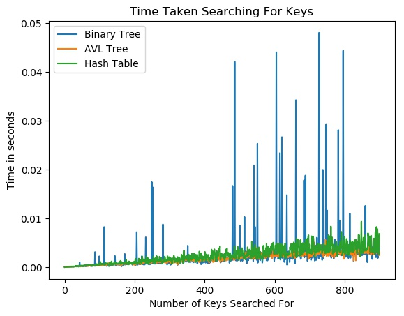
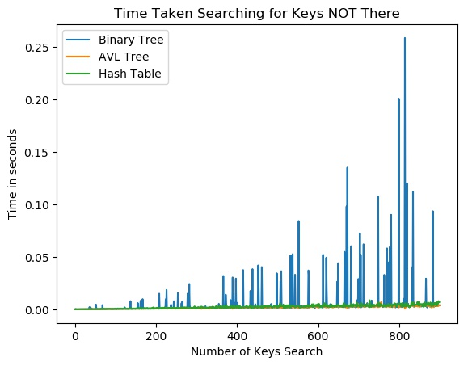

# Tree
This assignment explores the Binary Tree and AVL Tree data structures and compares their performance to Hash Tables.

## Benchmarking Results
Part of this assignment was to benchmark how long it takes the Binary Tree, AVL Tree, and Hash Tables to do the following tasks:
(1) insert a variable amount of key/value pairs into the data structure
(2) search for a variable amount of keys in the data structures
(3) do the same thing as (2) but for the same amount of keys that are NOT in the data structure

I used the python time module to do the benchmarking and decided to make graphs of Time vs number, where the number is either the number of key/value pairs (for task (1)) or keys (for task (2) and (3)).  I decided to run the benchmarking for a dataset with random keys and again with a data set that has sorted keys. My graph results are below and below the graphs are my comments on what the graphs show:

### Random Keys




(1) It appears that the Binary Tree takes the longest time to insert keys that are in the tree by far.  In fact the time it takes for the binary tree appears to increase faster than linearly for the number of keys inserted.  The AVL tree does the second best job and the Hash table does the best job.  The time it takes to insert pairs increases across all methods for an increased number of keys.
(2) It appears that the Binary Tree takes the longest time to search for keys that are in the tree by far.  The Hash table appears to perform second best with the AVL tree being the fastest.  The time it takes to search increases across all methods for an increased number of keys.
(3) It appears that the Binary Tree takes the longest time to search for keys that are NOT in the tree by far.  The Binary Tree time cost is orders of magnitude above the other methods.  The time it takes to search increases across all methods for an increased number of keys.

### Sorted Keys


(1) This first result is very similar to the random keys result.  It appears that the Binary Tree takes the longest time to insert keys that are in the tree by far.  In fact the time it takes for the binary tree appears to increase faster than linearly for the number of keys inserted.  The AVL tree does the second best job and the Hash table does the best job.  The time it takes to insert pairs increases across all methods for an increased number of keys.
(2) This second is fairly different than the random keys.  The difference between the searching for keys is much smaller than it was above.  The Binary Tree still appears to be the worst, but not by as much.  The second best is the Hash Table and then the AVL tree is the fastest.  The time it takes to search increases across all methods for an increased number of keys.
(3) This result is similar to the describtion of (2) above. The difference between the searching for keys NOT in the data is much smaller than it was for the random keys.  The Binary Tree still appears to be the worst, but not by as much. The Hast Table does the second best job and the AVL Tree does the best job.  The time it takes to search for keys increases across all methods for an increased number of keys.

## Git Submodules
This code relies on the avl_tree and hash-tables-rachelbowyer submodules.

## Modules, Scripts, and Shell File

### Scripts
insert_key_value_pairs.py:  This script takes 3 arguments: (1) the file that contains the keys/value pairs, (2) the type of data structure to use (choices: AVL, tree, hash), and (3) the number of key/value pairs to use

grapher.py: This script contains graphing functions that I used to create the benchmarking results.

### Files
rand.txt: contains 10,000 key/value pairs where the keys are random

sorted.txt: contains 10,000 key/value paris where the keys are sorted

rand_not.txt: contains 10,000 key/value pairs that are NOT in rand.txt or sorted.txt

### Functional and Unit Tests
test_trees.py: contains unit tests for Binary Tree and AVL Trees

hash-tables-rachelbowyer/hash_test.sh: contains tests for the hash tables

test_insert_pairs.sh: contains functional tests for insert_key_value_pairs.py and grapher.py

## Running Code
In order for the hash table submodule to function correctly, be sure to run
```
git submodule update --init
```


## Example
An example of running insert_key_value_pairs.py is 
```
python insert_key_value_pairs.py rand.txt tree 1000
```

An example of running grapher.py is
```
python grapher.py rand.txt rand_not.txt tree 900
```

An example of running test_insert_key_value_pairs.py is 
```
python test_insert_key_value_pairs.py
```